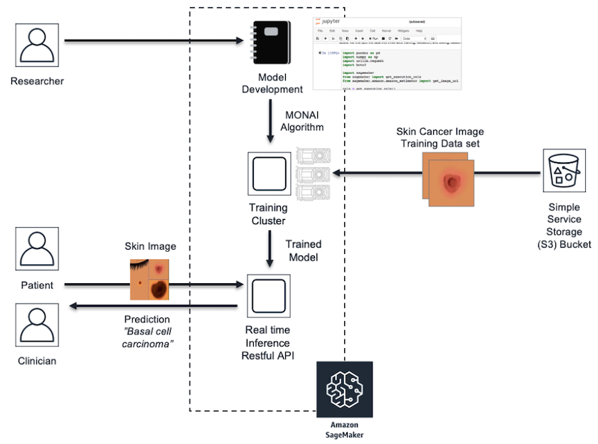

## SageMaker and MONAI using Pytorch

Medical Open Network for AI [MONAI](http://monai.io) was released in April 2020 and is a PyTorch based open-source framework for deep learning in healthcare imaging.  As stated on their website, project MONAI is an initiative “to establish an inclusive community of AI researchers for the development and exchange of best practices for AI in healthcare imaging across academia and enterprise researchers.”  MONAI features include flexible pre-processing transforms for multi-dimensional data, portable API(s) for ease of integration into existing workflows, and domain specific implementations for networks, losses, and evaluation metrics.

We will demonstrate how to integrate the MONAI framework into the [Amazon SageMaker](https://aws.amazon.com/sagemaker/) managed service and give example code of MONAI pre-processing transforms that can assist with imbalanced datasets and image transformations.  We will also review the code to invoke MONAI neural network architectures such as Densenet for image classification and explore structure of PyTorch code to train and serve the model within SageMaker.  Additionally, we will cover the SageMaker API calls to launch and manage the compute infrastructure for both model training and hosting for inference.  The examples are based on a skin cancer classification model that predicts skin cancer classes and uses the HAM10000  dermatoscopy skin cancer image dataset published by Harvard.

## Components

This MONAI Skin Cancer model implementation utilizes:

- Amazon S3 bucket for skin cancer images
- Amazon Sagemaker Notebook instance ml.t2.medium with 100 GB EBS and conda_pytorch_p36 kernel
- Amazon Sagemaker Pytorch managed container
- [HAM10000 dataset](https://dataverse.harvard.edu/dataset.xhtml?persistentId=doi:10.7910/DVN/DBW86T) hosted by Harvard Dataverse
- MONAI 0.3.0

    

## Architecture

The skin cancer predictive model uses Amazon Sagemaker architecture which includes model development within managed Jupyter Notebooks, integration with the MONAI framework by extending a SageMaker managed PyTorch container, and training on ephemeral clusters that use the HAM10000 dataset uploaded to S3.  Once the model is trained, it is deployed to a SageMaker real-time endpoint for hosting that is composed of one or more managed Amazon Elastic Compute (EC2) instances which are deployed over different availability zones for high availability.  For inferences, we submit a sample of patient skin cancer images from the HAM10000 validation dataset to the endpoint via the SageMaker API which returns the model predictions for class and probability.

### Sagemaker Model Lifecycle including MONAI framework

## Deploy Instructions

To run the skin cancer model using MONAI follow the steps below:

<ol>
<li>Create an S3 bucket in your account.
<li>Navigate to the dataset download at HAM10000 URL above.
<li>Select "Access Dataset" in top right, and review the license Creative Commons Attribution-NonCommercial 4.0 International Public License. 
<li>If you accept license, then select "Original Format Zip" and upload the zip to the S3 bucket created in previous steps.
<li>Navigate to Amazon Sagemaker in the same account to create a Jupyter Notebook instance.
<li>Under Notebook > Notebook instances select Create Notebook instance. Fill in the name (ex. skin-cancer-notebook) and instance type ml.t2.medium and select volume size of 100 GB.
<li>The Notebook will need permissions to call other services including SageMaker and S3.  Choose an existing role or create a role with the AmazonSageMakerFull Access IAM role.  
<li>Create Notebook instance and once In Service, then Open Jupyter Lab.
<li>In the Jupyter Notebook, select File > New > Terminal, cd SageMaker and execute
    <code> git clone https://github.com/aws-samples/amazon-sagemaker-monai-examples </code>
<li>Update the set.env file within Jupyter Notebook with the S3 location (SKIN_CANCER_BUCKET) and prefix/path (SKIN_CANCER_BUCKET_PATH) of the dataverse_files.zip uploaded to S3.
<li>Open the Jupyter Notebook monai_skin_cancer.ipynb and Run > Run all cells to observe the skin cancer example using MONAI.
<li>The example output shows inference results on five sample skin cancer images from the validation set and includes probablity of the skin cancer classification.
</ol>

## License

This project is licensed under the MIT-0 License.

## FAQ
Will these examples work outside of Amazon SageMaker Notebook Instances?

Although most examples utilize key Amazon SageMaker functionality such as managed training or real-time hosted endpoints, this example can be run outside of Amazon SageMaker Notebook Instances with modification (updating IAM role definition and installing the necessary libraries).